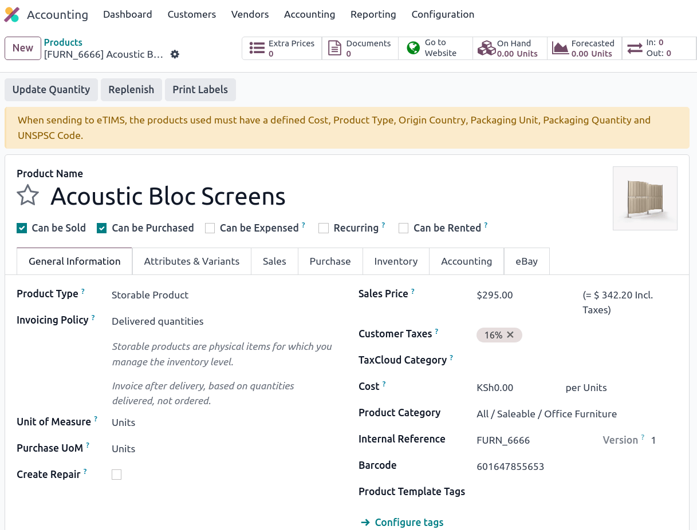
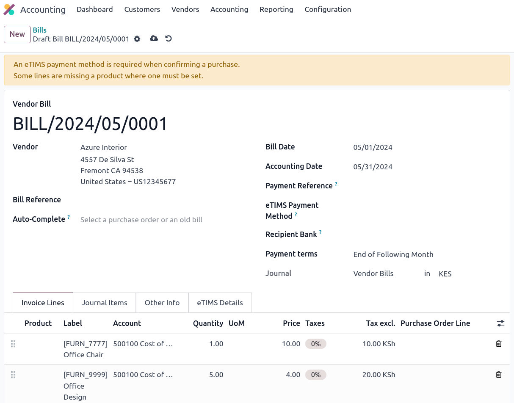

=====
Kenya
=====

.. _localization/kenya/configuration:

Configuration
=============

Install the 🇰🇪 **Kenyan** fiscal localization package :ref:`fiscal localization package
<fiscal_localizations/packages>` to get all the features of the Kenyan localization.

eTIMS
=====

The `Kenya Revenue Authority (KRA) <https://www.kra.go.ke/>`_ has decided to go digital for tax
collection through the `electronic Tax Invoice Management System (eTIMS)
<https://www.kra.go.ke/online-services/etims>`_.

Odoo has developed an :abbr:`OSCU (Online Sales Control Unit)` that integrates with the existing
**Trader Invoicing System (TIS)**. The OSCU validates, encrypts, signs, transmits, and stores tax
invoices.

.. note::
   Make sure to install the **Kenya eTIMS EDI** modules to fully use the OSCU device.

OSCU device initialization
--------------------------

Users must initialize their OSCU before they can use it. Before initialization, navigate to
:guilabel:`Odoo Database --> Settings --> General Settings`, click :guilabel:`Update Info`, and in
the :guilabel:`General Information` tab, enter your tax ID in the :guilabel:`Tax ID` field.

To initialize the OSCU, go to the :guilabel:`eTIMS` tab. Fill in the :guilabel:`eTIMS Branch Code`
and :guilabel:`Serial Number` of the device. Make sure to set :guilabel:`eTIMS Server Mode` to
:guilabel:`Test` for the initialization. When done, tick the **user agreement** and click
:guilabel:`Initialize OSCU`. Your device is now authenticated.

.. note::
   Three :guilabel:`Server Mode` are available:

   - :guilabel:`Demo`: Uses mocked data and does not require an initialized OSCU. Serves demo
     purposes;
   - :guilabel:`Test`: Used to test the connection to eTIMS;
   - :guilabel:`Production`: Used for live databases ready to send data.

.. Important::
   If your device has **already been authenticated** (through another ERP, for example), enable
   :doc:`../../general/developer_mode` and go to the :guilabel:`eTIMS` tab. The field
   :guilabel:`Device Communication Key` is now available. Enter the key obtained through a previous
   authentication, :guilabel:`Save manually`, and click :guilabel:`Initialize OSCU`. It **may take
   time** before the button is available as the initialization was made elsewhere before.

eTIMS codes
-----------

Common standard codes are **automatically** fetched from the KRA eTIMS API servers every **two
days**. These can be fetched **manually** by enabling :doc:`../../general/developer_mode` and going
to :menuselection:`Settings --> Technical --> Automation: Scheduled Actions -->
KE eTIMS: Fetch KRA standard codes`. Here, click :guilabel:`Run Manually` to fetch the codes.

The complete list of fetched OSCU codes can be found under :menuselection:`Accounting -->
Configuration --> KE OSCU Codes`.

.. image:: kenya/oscu-codes.png
   :alt: List of fetched OSCU codes.

.. _etims/unspsc:

UNSPSC codes
------------

UNSPSC codes are **automatically** fetched from the KRA eTIMS API servers **every day**. The KRA
**needs** codes for a product to be **registered**. These codes can be **manually** fetched by
enabling :doc:`../../general/developer_mode` and going to :menuselection:`Settings --> Technical -->
Automation: Scheduled Actions --> KE eTIMS: Fetch UNSPSC codes from eTIMS`. Here, click
:guilabel:`Run Manually` to fetch the codes.

The complete list of fetched UNSPSC codes can be found under :menuselection:`Accounting -->
Configuration --> KE OSCU Codes`.

Notices
-------

Notices are **automatically** fetched from the KRA eTIMS API servers **every day**. These notices
can be fetched **manually** by enabling :doc:`../../general/developer_mode` and going to
:menuselection:`Settings --> Technical --> Automation: Scheduled Actions --> KE eTIMS: Fetch KRA
notices from eTIMS`. Here, click :guilabel:`Run Manually` to fetch the codes.

The complete list of fetched notices can be found under :menuselection:`Accounting --> Configuration
--> KE OSCU Notices`.

Multi-company
-------------

.. _kenya/branch:

.. seealso::
   :doc:`../../general/companies`

The company ID can be configured under the **Settings** app. Click :guilabel:`Update Info` in the
**Companies** section, and finally, click the :guilabel:`eTIMS` tab. The **main company** has a
branch ID equal to `00` in a multi-company environment. Companies that are *not* the main company
have a branch ID other than `00` and are assigned an ID **by the KRA**.

.. note::
   The KRA considers that each **place of supply** corresponds to a branch (ID).

Fetch branch ID from the KRA
~~~~~~~~~~~~~~~~~~~~~~~~~~~~

In the **Settings** app, under :guilabel:`Update Info` in the **Companies** section, users can fetch
**branch information** from the KRA for their non-main companies *if* the **main company** has a
Kenyan :guilabel:`Tax ID` and the **OSCU** device has been initialized. To do so, click the
:guilabel:`Branches` and then :guilabel:`Populate from KRA`. Once the information fetched, branches
for this **main company** can be created.

.. note::
   The **OSCU** device must be **initialized independently** for each branch.

.. image:: kenya/branches.png
   :alt: "Populate from KRA" button for branches.

Partner branch ID
-----------------

When creating a **new partner** or modifying an **existing partner**, a **branch code** can be
attributed to that partner. To do so, go to :menuselection:`Accounting --> Customers --> Customers`
or :menuselection:`Vendors --> Vendors`, click a partner, and in the :guilabel:`Accounting` tab,
enter a **branch code** in the :guilabel:`eTIMS Branch Code` field.

.. note::
   By default, partners' branch codes are set to `OO`.

KRA Sequences
-------------

.. important:
   Odoo invoice sequences and KRA sequences are **different**.

In Odoo, invoice sequences depend on the **parent (main) company**. Parent companies can see the
invoices of branches, but branches **cannot** see the parent company's invoices or those of other
branches.

.. example::
   If you have a **main** company with **two branches**, the invoice sequence would be the
   following:

   - Creating an invoice on **branch 1**: INV/2024/00001
   - Creating an invoice on **branch 2**: INV/2024/00002
   - Crating on invoice on **parent company**: INV/2024/00003

The KRA, however, needs **independent** sequences per branch. Odoo, therefore, manages sequences
**individually** per branch.

.. example::
   This is how Odoo manages sequences to be compliant with the KRA regulations:

   - Creating an invoice on **branch 1**: INV/2024/00001
   - Creating an invoice on **branch 2**: INV/2024/00001
   - Creating an invoice on **parent company**: INV/2024/00001

Insurance
=========

For **health service providers**, users can send **insurance information** about the main and branch
offices and update it in eTIMS. To do so, open the **Settings** app, click :guilabel:`Update Info`
in the **Companies** section, and in the :guilabel:`eTIMS` tab, fill in the fields related to your
company: :guilabel:`Insurance Code`, :guilabel:`Insurance Name`, and :guilabel:`Insurance Rate`.

.. _kenya/product-registration:

Items registration
==================

The KRA requires **products to be registered** first before business operations (such as stock
movements, :abbr:`BOM (Bill of Materials)`, customer invoices, etc.). To be registered, each product
must have the following elements defined. These can be found in the **product form view**
(:menuselection:`Accounting --> Customers --> Products` or :menuselection:`Accounting --> Vendors
--> Products`) by clicking a **product** under the :guilabel:`General Information` tab and the
:guilabel:`Accounting` tab (in the **KRA eTIMS details** section).

Under the :guilabel:`General information` tab:

- :guilabel:`Cost`.

Under the :guilabel:`Accounting` tab:

- :guilabel:`Packaging Unit`;
- :guilabel:`Packaging Quantity`;
- :guilabel:`Origin Country`;
- :guilabel:`eTIMS Product Type`;
- :guilabel:`Insurance Applicable`;
- :ref:`UNSPSC Category <etims/unspsc>`.

Odoo checks to see if the elements above are defined when conducting business operations. If yes,
the product is automatically registered while sending the operation to the KRA. If not, the user is
alerted by a yellow banner at the top of the screen they are currently viewing, inviting them to
check the missing elements by clicking :guilabel:`View Product(s)`.

Stock movements
===============

All **stock movements** must be sent to the KRA. They do not require an invoice if they are
**internal operations** or **stock adjustments**. Therefore, Odoo automatically sends them if the
following conditions are met:

#. No partners are set for the move; or
#. The partner is your main company or a branch of the main company.

If the stock moves are **external** (e.g., to someone external the main company or its branches),
the stock moves are automatically sent *after* the invoice is sent to eTIMS.

.. note::
   - The stock move must be confirmed before sending the invoice to eTIMS;
   - The product(s) must be registered for the stock move to be sent to eTIMS. If not, a yellow
     banner appears to prompt registration.

Purchases
=========

Odoo automatically fetches new vendor bills from eTIMS every day. Users need to confirm the fetched
vendor bills and the confirmation to the KRA. Every bill confirmation must be associated with a
validated receipt. To do so, each bill must be linked to purchase order lines.

.. _kenya/purchases:

In the case of purchases **(not customs imports)**, the steps to link purchase order lines with
bills are the following:

#. The vendor bill is fetched from the KRA servers. The JSON file is available in the chatter of the
   vendor bill if needed;
#. Odoo looks at the **PIN** (tax ID) of the partner;

   - If it is unknown, a new partner is created;
   - If it is known and the branch ID is the same, Odoo uses the known partner.

#. The user must match the fetched vendor bill with an existing product. Each vendor bill must
   contain a product to be confirmed and sent to eTIMS later on.
#. Odoo looks at the existing purchase order lines matching the product and partner (if any). The
   user must select the correct related purchase order line from the
   :guilabel:`Purchase Order Line`: dropdown list. The received quantities on the purchase order
   must be on the same as those indicated on the vendor bill. If not, the vendor bill cannot be sent
   to eTIMS (indicated by a yellow banner).

   - If no existing purchase order lines match the fetched invoice lines, users can create a
     purchase order based on the unmatched lines. The resulting stock move *must* be validated. Once
     done, users can confirm and send the bill to eTIMS.

#. Make sure to set a method in the :guilabel:`eTIMS Payment Method` field of the bill to send the
   vendor bill to the KRA.
#. Once all steps are completed, the vendor bill can be sent by clicking :guilabel:`Send to eTIMS`.
   When the vendor bill has been confirmed on eTIMS, the **KRA invoice number** can be found under
   the :guilabel:`eTIMS Details`.

Invoicing
=========

.. note::
   The KRA does *not* accept sales if the product is not in stock.

This is the **advised sales flow** in Odoo when selling:

#. Create a **sales order**;
#. :guilabel:`Validate` the invoice;
#. :guilabel:`Confirm` the invoice;
#. Click :guilabel:`Send and print`, and then tick the :guilabel:`Send to eTIMS` box.
#. Finally, click :guilabel:`Send & print` to send the invoice.

Once the invoice has been sent and signed by the KRA, the following information can be found on
it:

- **KRA invoice number**;
- Mandatory KRA invoice fields, such as **SCU information**, **date**, **SCU ID**, **receipt
  number**, **item count**, **internal date**, and **receipt signature**;
- The **KRA tax table**;
- A unique **KRA QR code** for the signed invoice.

Imports
=======

Customs imports codes are **automatically** fetched from the KRA eTIMS API servers **every day**.
These codes can be **manually** fetched by enabling :doc:`../../general/developer_mode` and going to
:menuselection:`Settings --> Technical --> Automation: Scheduled Actions --> KE eTIMS: Receive
Customs Imports from the OSCU`. Here, click :guilabel:`Run Manually` to fetch the codes. Import
items can be found under :menuselection:`Accounting --> Vendors --> Customs Imports`.

The following steps are required to send and have **customs imports** signed by the KRA:

#. The customs import is fetched automatically from the KRA.
#. Users *must* match the imported item with an existing registered product (or create a product if
   no related product exists) in the :guilabel:`Product` field.
#. Set a vendor in the :guilabel:`Partner` field.
#. Based on the partner, the user must match the imported item with its related purchase order
   (see :ref:`purchase steps <kenya/purchases>`). The stock must be correctly adjusted when then
   customs import is approved.
#. If no related purchase order exists, the user must create one. The :guilabel:`Product` and
   :guilabel:`Partner` must have been set before.
#. Finally, click :guilabel:`Match and Approve` or :guilabel:`Match and Reject`, depending on the
   situation of the goods.

.. note::
   The JSON file received from the KRA is attached to the form view of the customs import.

BOM
===

The KRA requires all BOMs to be sent to them. To send BOMs to eTIMS, the product and its components
*must* be :ref:`registered <kenya/product-registration>`. To access a product's BOM, click on the
product, and then click on the :guilabel:`Bill Of Materials`.

Fill in the KRA's required fields, and then click :guilabel:`Send to eTIMS`. The successful
sending of the BOM is confirmed in the chatter, where the information sent about the BOM can also be
found in a JSON file attached to the chatter.

Credit notes
============

The KRA does not accept credit notes with quantities or prices higher than the initial invoice. A
KRA reason must be indicated when reversing the invoice.
