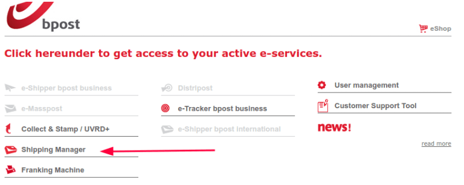
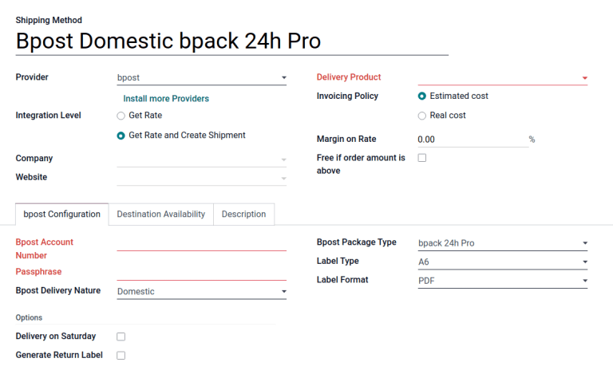

=================
Bpost integration
=================

Set up the *bpost* shipping connector in Odoo to manage Bpost shipments to clients directly within
Odoo.

To set up the bpost shipping connector in Odoo, complete these steps:

#. Create a bpost account.
#. Get the :ref:`Account ID and passphrase <inventory/shipping/bpost-account>`.
#. Set up the shipping method in Odoo.

Upon completion, it will be possible to calculate the cost of shipping based on package size and
weight, have the charges applied directly to a bpost business account, and automatically print bpost
tracking labels through Odoo.

.. seealso::
   - :doc:`third_party_shipper`
   - :doc:`delivery_method`
   - :doc:`dhl_credentials`
   - :doc:`ups_credentials`

bpost account setup
===================

To begin, go to the `bpost website <https://parcel.bpost.be/en/home/business>`_ to create or log
into the company's bpost business account. When creating the bpost account, have the company's VAT
number and mobile phone number ready. Follow the website's steps to complete registration and sign
up for shipping services.

After completing the setup, get the bpost account ID and passphrase by navigating to the
:guilabel:`Shipping Manager` menu item.

.. _inventory/shipping/bpost-account:

On the :guilabel:`Shipping Manager` page, go to the :guilabel:`Admin` tab, then the
:guilabel:`General Settings` tab, to find the :guilabel:`Account ID` and :guilabel:`Passphrase`
needed to configure Odoo's shipping method.

.. image:: bpost/credentials.png
   :align: center
   :alt: In the *Admin* tab, show the Account ID and Passphrase.

Shipping method
===============

With the credentials, configure the bpost shipping method in Odoo by going to
:menuselection:`Inventory app --> Configuration --> Shipping Methods`.

On the :guilabel:`Shipping Methods` page, click :guilabel:`Create`.

In the :guilabel:`Provider` field, select :guilabel:`bpost`. Doing so reveals the :guilabel:`bpost
Configuration` tab, where the bpost credentials can be entered. For details on configuring the other
fields on the shipping method, such as :guilabel:`Delivery Product`, refer to the :doc:`Configure
third-party carrier <third_party_shipper>` documentation.

.. note::
   To print bpost :doc:`shipping labels <../operation/labels>` through Odoo, ensure the
   :guilabel:`Integration Level` option is set to :guilabel:`Get Rate and Create Shipment`.

In the :guilabel:`bpost Configuration` tab, complete the following fields:

- :guilabel:`Bpost Account Number`: (required field) enter the company's unique :ref:`account number
  <inventory/shipping/bpost-account>` from the bpost website.
- :guilabel:`Passphrase`: (required field) enter the :ref:`passphrase
  <inventory/shipping/bpost-account>` from the bpost website.
- :guilabel:`Bpost Delivery Nature`: select either :guilabel:`Domestic` or :guilabel:`International`
  shipping services.
- :guilabel:`Bpost Package Type`: select the type of `shipping service
  <https://help.shipmondo.com/en/articles/6092265-bpost-belgium-parcel-types-and-requirements>`_
  from the drop-down menu.

  For domestic delivery, the options are: :guilabel:`bpack 24h Pro`, :guilabel:`bpack 24h business`,
  or :guilabel:`bpack Bus`.

  For international delivery, the options are: :guilabel:`bPack World Express Pro`, :guilabel:`bpack
  World Business`, or :guilabel:`bpack Europe Business`.
- :guilabel:`Shipment Type`: (required field) for international deliveries, declare the type of
  goods in the package as :guilabel:`SAMPLE`, :guilabel:`GIFT`, :guilabel:`GOODS`,
  :guilabel:`DOCUMENTS`, or :guilabel:`OTHER`.
- :guilabel:`Bpost Parcel Return Address`: return address when an international shipment fails to
  deliver. Select from the drop-down menu: :guilabel:`Destroy`, :guilabel:`Return to sender by air`,
  or :guilabel:`Return to sender by road`.
- :guilabel:`Label Type`: choose :guilabel:`A6` or :guilabel:`A4` label sizes.
- :guilabel:`Label Format`: choose :guilabel:`PDF` or :guilabel:`PNG` from the drop-down menu.

For domestic deliveries, these features are available in the :guilabel:`Options` section:

- :guilabel:`Delivery on Saturday` feature to enable Saturdays as a possible delivery date.
  Depending on the :guilabel:`Bpost Package Type` selected, this option might incur additional costs
  to the company.

- :guilabel:`Generate Return Label` features to automatically print a return label upon validating
  the delivery order.

