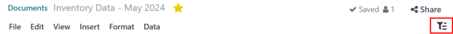
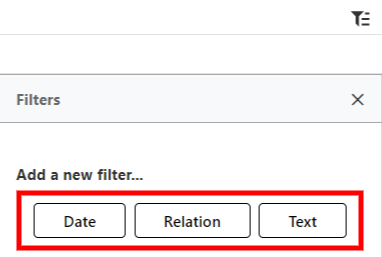
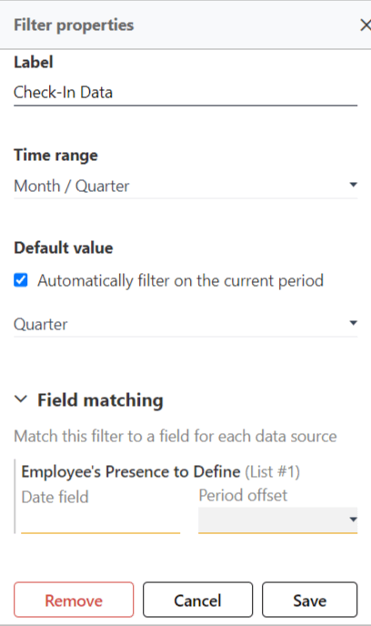
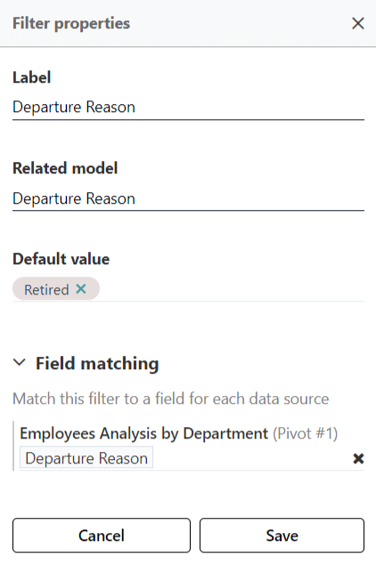
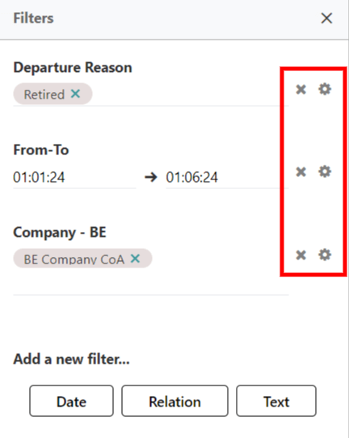

=======
Filters
=======

A filter is a tool that presents specific data in a spreadsheet within the *Documents* app.

Different filter options are available to use, depending on the data contained in the spreadsheet.
If a specific filter does not apply to a spreadsheet, that filter is not available.

.. example::
   A spreadsheet contains only information about the quantities of product in a warehouse, and does
   **not** have any date-related information. No filters relating to dates appear in the presented
   filters list.

Filters work by first setting the parameters for a filter, then making selections *within those
parameters* to present specific data. Each filter is created in this two-part process: setting
parameters, then specifying the values of the parameters.

To access the available filters for a spreadsheet, first navigate to the :menuselection:`Documents
app`, then click on the desired spreadsheet. Next, click the :icon:`fa-filter` :guilabel:`(Filters)`
icon in the top-right corner to view the available filters.

Add a new filter
================

If no filters have been configured for a spreadsheet, a new filter must first be added.

Click the :icon:`fa-filter` :guilabel:`(Filters)` icon in the top-right corner, and a
:guilabel:`Filters` popover window appears.

Beneath the heading :guilabel:`Add a new filter...`, click on one of the presented filter options:
:ref:`Date <filters/date>`, :ref:`Relation <filters/relation>`, or :ref:`Test <filters/text>`. The
options presented are the only filters that apply to the selected spreadsheet.

Below are all the various options that can appear in the :guilabel:`Add a new filter...` list.

Once the information is entered for a filter, click :guilabel:`Save` to save the filter
configuration. Once saved, the filter appears beneath the :guilabel:`Filters` heading, and above the
:guilabel:`Add a new filter...` section, and is ready to use. Once configured, the specific
parameters within the filter can be selected, and the information is then presented.

.. _filters/date:

Date
----

This filter selection organizes and presents data in the spreadsheet that are based on a specific
time period.

First, the :guilabel:`Filter properties` must be configured. These settings determine what specific
data is presented.

Select this type of filter if the data should be filtered by specific time periods.

Populate the following fields presented in the date filter:

- :guilabel:`Label`: enter a name for the specific filter. This filter name appears when this
  spreadsheet is opened in the future, and is available until the configured filter is deleted.
- :guilabel:`Time range`: select the desired time frame to present. Options are either:

  - :guilabel:`Month / Quarter`: presents data filtered by either a specific quarter or month.
  - :guilabel:`Relative Period`: presents data for preconfigured time periods, other than a month
    or quarter, such as :guilabel:`Year To Date`, or :guilabel:`Last 30 Days`.
  - :guilabel:`From / To`: presents data that spans a specific time period **other than** a quarter
    or month, such as the specific dates of an event, promotion, or management time period.

- :guilabel:`Default value`: this selection appears **only** if either :guilabel:`Month / Quarter`
  or :guilabel:`Relative Period` is selected for the :guilabel:`Time range`. The option presented is
  to :guilabel:`Automatically filter (the data) on the current period`. Tick the checkbox to
  activate this option. When activated, a drop-down menu appears. Select the time period to present,
  either :guilabel:`Month`, :guilabel:`Quarter`, or :guilabel:`Year`.
- :guilabel:`Field matching`: the spreadsheet can be further filtered down, if desired. It is
  possible to specify which fields on the spreadsheet to apply the filter on. When entering a value
  for a :guilabel:`Date` filter, two fields must be populated: the :guilabel:`Date Field` and the
  :guilabel:`Period Offset`.

When all the information is entered on the form, click the :guilabel:`Save` button.

Once a filter is configured and saved, it appears beneath the :guilabel:`Filters` heading, and above
:guilabel:`Add a new filter...`. Beneath the skill label, a drop-down menu appears. This allows to
filter the data by the set :guilabel:`Time rage` set for the filter.

.. example::

   - If a filter is created with :guilabel:`Month / Quarter` selected for the :guilabel:`Time
     range`, two drop-down menus appear beneath the filter label: :guilabel:`Select period...` and
     :guilabel:`Select year...`.

     :guilabel:`Select period...` allows either a specific quarter (:guilabel:`Q1`, :guilabel:`Q2`,
     etc.) or a specific month (:guilabel:`January`, :guilabel:`February`, etc.) to be selected.

     The :guilabel:`Select year...` allows for the selection of any specific year.

   - If a filter is created with :guilabel:`Relative Period` selected for the :guilabel:`Time
     range`, sone drop-down menu appears beneath the filter label: :guilabel:`Select period...`.

     :guilabel:`Select period...` allows a specific range of time (:guilabel:`Year to Date`,
     :guilabel:`Last 30 Days`, :guilabel:`Last 3 Years`, etc.) to be selected.

   - If a filter is created with :guilabel:`From / To` selected for the :guilabel:`Time range`,
     two drop-down menus appear beneath the filter label: :guilabel:`Date from...` and
     :guilabel:`Date to...`.

     Using the calendar popover, select the date range for the filter.

.. _filters/relation:

Relation
--------

This filter selection organizes and presents data in the spreadsheet that are based on a specific
model of information within Odoo.

.. note::
   Most data entered in Odoo populates fields based on a model or formula. This method for
   populating a variety of fields is what is accessed to filter data by.

First, the :guilabel:`Filter properties` must be configured. These settings determine what specific
data is presented.

Select this type of filter if the data should be filtered by specific models.

Populate the following fields presented in the date filter:

- :guilabel:`Label`: enter a name for the specific filter. Note that if this field is left blank,
  once a :guilabel:`Related model` is selected, that selection text populates the :guilabel:`Label`
  field.
- :guilabel:`Related model`: using the drop-down menu, select a model from the list. The available
  models to select is based on the information presented in the spreadsheet.
- :guilabel:`Default value`: this selection appears **only** after a selection is made for the
  :guilabel:`Related model` field. Using the drop-down menu, select the :guilabel:`Default value`.
  The presented options are directly related to the selected :guilabel:`Related model`; changing the
  :guilabel:`Related model` changes the options in the drop-down menu.

         because they retired.

.. _filters/text:

Text
----

This filter selection organizes and presents data in the spreadsheet that are based on specific
words.

First, the :guilabel:`Filter properties` must be configured. These properties determine what
specific data is presented.

Select this type of filter if the data should be filtered by specific words.

Populate the following fields presented in the text filter:

- :guilabel:`Label`: enter a name for the specific filter.
- :guilabel:`Restrict values to a range`: tick the checkbox to limit the results to a specific
  range of values. When enabled, a blank text box appears. Enter the range in the field. If the
  entered range is not applicable, the box turns red and a red :icon:`fa-exclamation-circle`
  :guilabel:`(Exclamation)` icon appears.
- :guilabel:`Default value`: enter a default value for the search criteria in this field.
- :guilabel:`Field matching`: the spreadsheet can be further filtered down, if desired. It is
  possible to specify which fields on the spreadsheet to apply the filter on. Using the drop-down
  menu, select the field that the filter applies to.

  .. note::
     The information presented in the spreadsheet is indicated in the :guilabel:`Field Matching`
     section. For example, if a spreadsheet is presenting employee contracts organized by
     department, the :guilabel:`Field Matching` section displays :guilabel:`Employees Analysis by
     Department (Pivot #1)` in the field, above the blank lie where information is populated.

Manage filters
==============

Once a filter is configured, it appears on the right-side of the spreadsheet.

To change the order in which the filters appear, hover over a filter to reveal a
:icon:`fa-ellipsis-v` :guilabel:`(vertical ellipses)` icon. Click on the icon and drag the filter to
the desired location.

To remove a configured filter, click the :icon:`fa-times` :guilabel:`(Clear)` icon to the right of
the filter.

To make any edits to the filter configuration, click the :icon:`fa-cog` :guilabel:`(Edit)` icon to
the right of the :icon:`fa-times` :guilabel:`(Clear)` icon. Make any edits to the filter, then
click :guilabel:`Save`.

All filters created for the spreadsheet appear in this list, until they are removes with the
:icon:`fa-times` :guilabel:`(Clear)` icon. There is no limit on the filters that can be added to the
spreadsheet.
