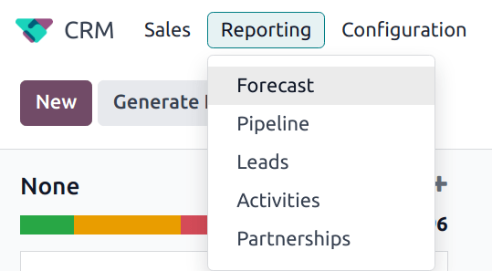
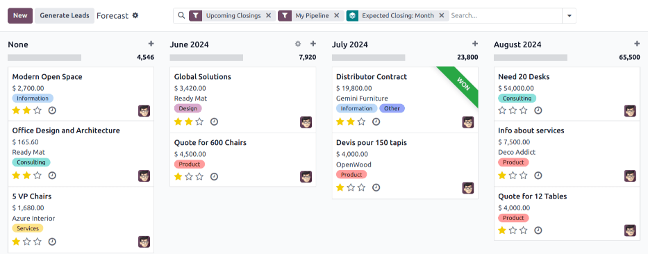

===============
Forecast report
===============

.. |caret| replace:: :icon:`fa-caret-down` :guilabel:`(down)` icon
.. |pivot| replace:: :icon:`oi-view-pivot` :guilabel:`(pivot)` icon
.. |list| replace:: :icon:`oi-view-list` :guilabel:`(list)` icon

The *Forecast* report in the *CRM* app allows users to view upcoming opportunities and build a
forecast of potential sales. Opportunities are grouped by the month of their expected closing date,
and can be dragged-and-dropped to adjust the deadline.

To access the *Forecast* report, navigate to :menuselection:`CRM app --> Reporting --> Forecast`.

Navigate the forecast report
============================

The default display for the forecast report includes the opportunities assigned to the current
user's pipeline that are expected to close within the current month, or the following three months.
The opportunities are grouped by month in a Kanban (:icon:`oi-view-kanban`) view.

Expected closing date
---------------------

Opportunities are grouped by the date assigned in the :guilabel:`Expected Closing` field. To change
this date, select the Kanban card for the desired opportunity, then click and drag the card to the
column for a different month.

.. note::
   The default time frame for the forecast is *month*. This can be changed by clicking the |caret|
   next to the :guilabel:`Search...` bar at the top of the report. Under the :guilabel:`Group By`
   heading, click :guilabel:`Expected Closing` to expand the list of available options, and select
   from the list.

After an opportunity is added to a new month, the :guilabel:`Expected Closing` field is updated to
the *last* date of the new month.

.. tip::
   The :guilabel:`Expected Closing` field can also be manually updated. Click on the Kanban card for
   an opportunity to open the opportunity's details form. Click in the :guilabel:`Expected Closing`
   field, and use the calendar pop-up to select a new closing date.

Prorated revenue
----------------

At the top of the column for each month, to the right of the progress bar is a sum of the prorated
revenue for that time frame.

The prorated revenue is calculated using the formula below:

.. math::

   \text{Expected Revenue} \times \text{Probability} = \text{Prorated Revenue}

As opportunities are moved from one column to another, the column's revenue is automatically updated
to reflect the change.

.. example::
   A forecast report for June includes two opportunities:

   The first opportunity, `Global Solutions` has an expected revenue of `$3,800` and a probability
   of `90%`. This results in a prorated revenue of `$3,420`.

   The second opportunity, `Quote for 600 Chairs` has an expected revenue of `$22,500`, and a
   probability of `20%`. This results in a prorated revenue of `$4,500`.

   The combined prorated revenue of the opportunities is `$7,920`, which is listed at the top of the
   column for the month.

   .. image:: forecast_report/example-revenue.png
      :align: center
      :alt: An example of the prorated revenue for one month of the forecast report.

.. seealso::
   For more information on how probability is assigned to opportunities, see
   :doc:`../track_leads/lead_scoring`

View results
============

Click the :icon:`fa-area-chart` :guilabel:`(area chart)` icon to change to graph view. Click the
corresponding icon at the top of the report to switch to a :icon:`fa-bar-chart` :guilabel:`(bar
chart)`, :icon:`fa-line-chart` :guilabel:`(line chart)`, or :icon:`fa-pie-chart` :guilabel:`(pie
chart)`.

.. image:: forecast_report/pie-chart-view.png
   :align: center
   :alt: A pie chart view of the Forecast report.

Click the |pivot| to change to the *pivot* view, or the |list| to change to the *list* view.

.. tip::
   The pivot view can be used to view and analyze data in a more in-depth manner. Multiple measures
   can be selected, and data can be viewed by month, and by opportunity stage.

   .. image:: forecast_report/pivot-view.png
      :align: center
      :alt: A sample of the forecast report in the pivot view.

.. seealso::
   To save this report as a *favorite*, see :ref:`search/favorites`.
